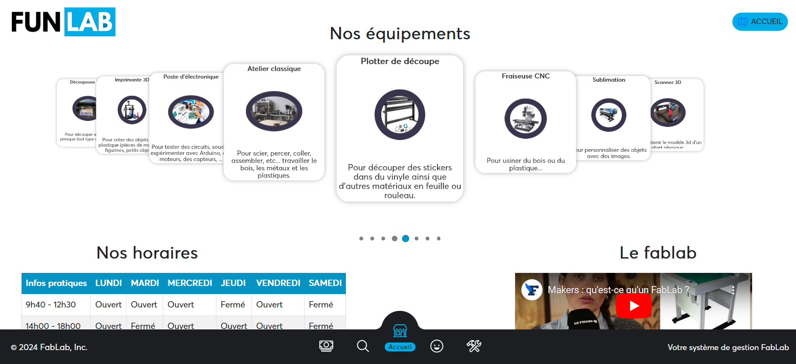
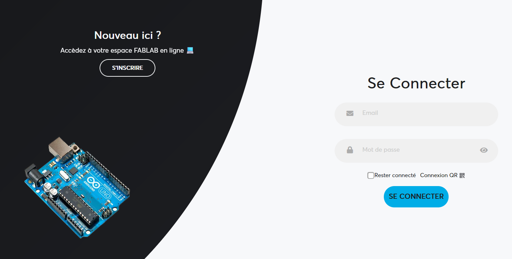
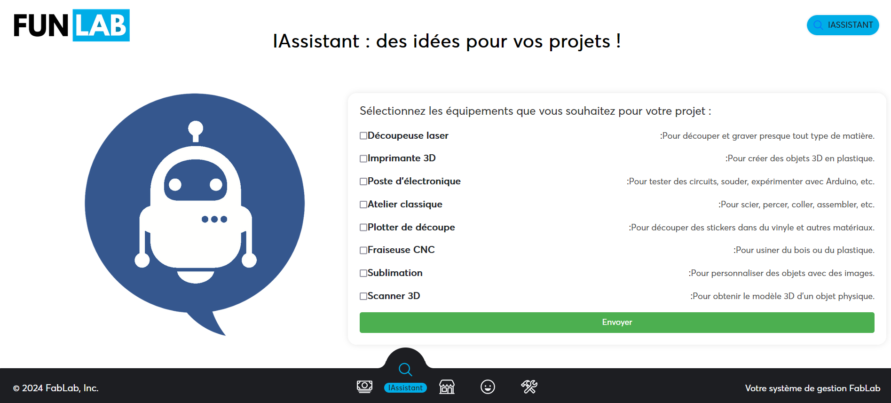

# FabLab Management System

  

## Introduction

The FabLab Management System is a comprehensive solution designed to streamline the operations of fabrication laboratories (FabLabs). This system leverages a modern technology stack including React, Node.js, MongoDB, along with integration of the ChatGPT API for enhanced user support and QR Code functionalities for efficient equipment management. It caters to both users and administrators through separate interfaces, providing a range of features from equipment and subscription management to operation reports and personal user histories.

## Table of Contents

- [Introduction](#introduction)
- [Project Structure](#project-structure)
- [Technologies and Tools](#technologies-and-tools)
- [Features](#features)
- [Development and Deployment](#development-and-deployment)
  - [Conception](#conception)
  - [Development](#development)
  - [Testing](#testing)
- [Setup Instructions](#setup-instructions)
  - [Database Setup](#database-setup)
  - [Server Configuration](#server-configuration)
  - [Application Configuration](#application-configuration)
  - [Starting the Application](#starting-the-application)
- [Additional Notes](#additional-notes)
- [Contributors](#contributors)
- [License](#license)

## Project Structure

- `src`: Contains the source code for the React frontend.
- `public`: Holds static files for the React app.
- `ServeurChatGpt`: Node.js server for ChatGPT integration.
- `ServeurStockage`: Node.js server for managing equipment and users.

## Technologies and Tools

- **Frontend:** React.js
- **Backend:** Node.js with Express.js
- **Database:** MongoDB
- **ChatGPT API:** Integrated for user support
- **QR Code:** For equipment management via mobile application scanning
- **Version Control:** Git

## Features

1. **User and Administrator Space**
   - Technology: React, Node.js
   - Description: Separate interfaces with specific rights and functionalities.
2. **Equipment Management and Inventory**
   - Technology: React, Node.js, MongoDB
   - Description: Manage equipment details including photos, descriptions, and statuses.
3. **Subscription and Lending Management**
   - Technology: Node.js, MongoDB
   - Description: Handles user subscriptions, equipment loans, and histories.
4. **QR Code Management**
   - Technology: QR Code libraries
   - Description: Enables equipment borrowing and returning through QR code scanning.
5. **Operation Reports**
   - Technology: Node.js, MongoDB
   - Description: Generates reports on equipment and user activity.
6. **Personal History for Users**
   - Technology: Node.js, MongoDB
   - Description: Provides users with their activity history within the FabLab.
7. **Demo Database**
   - Technology: MongoDB
   - Description: A demo database for testing and demonstration purposes.
8. **Additional Features**
   - ChatGPT API Integration, Content Management System for articles and tutorials.

## Development and Deployment

### Conception

- **Wireframes and Mockups:** Use tools like Figma for UI/UX design.
- **System Architecture:** Follow the MVC pattern.

### Development

- **Environment Setup:** Configure Node.js, React, and MongoDB.
- **ChatGPT API Feature:** Integrate ChatGPT API for user support.

### Testing

- **Unit Testing:** Utilize Jest for unit tests.
- **Integration and Performance Testing:** Conduct regular testing for quality and performance.

## Setup Instructions

### Database Setup

1. Import the demo database into MongoDB.
2. Ensure MongoDB is running.

### Server Configuration

1. Update the database IP address in the `ServeurStockage` configuration.
2. Start the `ServeurStockage` server with `node app.js`.
3. Install any missing Node.js packages with `npm i`.

### Application Configuration

1. Update the server IP address in the application configuration.
2. Install missing packages with `npm install`.

### Starting the Application

1. Run `npm start` from the project root.
2. HTTPS setup is automatic, with a shortcut command in `package.json`.

## Additional Notes

- **OpenAI Integration:** Install the OpenAI npm package and configure the `.env` file in the `ServeurChatGpt` directory with your API key. Avoid committing your API key to GitHub. Start the `ServeurChatGpt` server with `npm start`.

- **Selenium Testing:** Perform automated browser testing using Selenium.

Nolan CACHEUX.